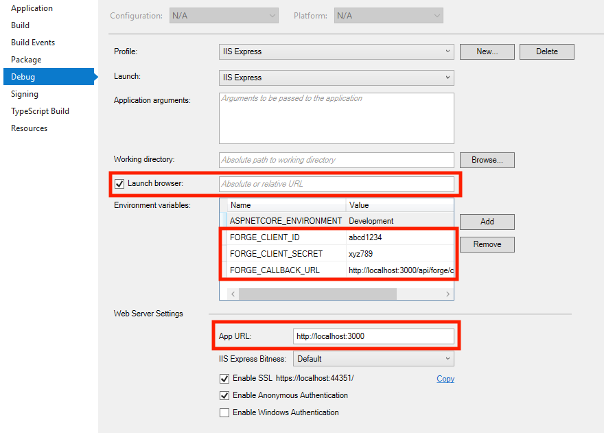
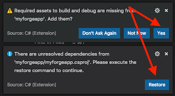

# View BIM 360 Assets


[](http://opensource.org/licenses/MIT)

[](http://forge.autodesk.com/)
[](http://forge.autodesk.com/)
[](http://forge.autodesk.com/)
[](http://forge.autodesk.com/)


# Description

Demonstrate how to read BIM 360 **Assets** data with Forge Viewer.

Uses [Data Management](https://forge.autodesk.com/en/docs/data/v2) to list hubs, projects and files. Uses [Viewer](https://forge.autodesk.com/en/docs/viewer/v6/overview/) to show models and extensions to create toolbar buttons and panels. The sample implements the following features in the **BIM360AssetExtension.js**:

- **BIM360AssetListPanel**: Lists [BIM 360](https://forge.autodesk.com/en/docs/bim360/v1/overview/) Assets on a data table with pagination support on the panel
- **BIM360AssetInfoPanel**: Display asset data of selected object from [BIM 360](https://forge.autodesk.com/en/docs/bim360/v1/overview/) Assets module.
- **BIM360SpaceFilterPanel**: Lists levels and rooms of the RVT model in a tree hierarchy, and it can apply proper section box (filter) to the model upon checked level or room to bring better view for assets.

## Thumbnail

This picture shows the functionalities of the `BIM360AssetExtension` from left-bottom side to right side accordingly are `BIM360SpaceFilterPanel`, `BIM360AssetListPanel` and `BIM360AssetInfoPanel`. The view is activating the level filter (sectioning) of the `BIM360SpaceFilterPanel` and showing the selected air terminal's asset info from the BIM360 Assets service by `BIM360AssetInfoPanel`.


This picture shows similar functionalities as the above one does, but the view activates the room filter of the `BIM360SpaceFilterPanel` where the selected air terminal is located instead.


## Demonstration

Here is the video demonstrating how this sample works quickly. First, it shows data of BIM360 Assets on the BIM360 Web UI, then go to the viewer sample to open `BIM360AssetListPanel`, `BIM360AssetInfoPanel` and `BIM360SpaceFilterPanel` sequentially, and data shown on the `BIM360AssetListPanel` is the same as we see on the BIM360 Web UI.

[](http://www.youtube.com/watch?v=aNLFpVgeOVc "Demo the possibility of BIM360 Assets API & Forge Viewer Integration")
[Click here or click on the above picture to view the video](http://www.youtube.com/watch?v=aNLFpVgeOVc)

**Note:** Demo video comes with subtitle. Click `CC` of YouTube video player button while playing the video and configure it with the options below for better video-watching experience:


## Limitation

- The BIM360 [Locations](https://help.autodesk.com/view/BIM360D/ENU/?guid=BIM360D_Administration_About_Project_Admin_about_location_html) API is not yet publicly released yet (still in private beta currently), so you will need to set up extra properties in the Revit model. Please check [Import sample data](#import-sample-data) for the detail instructions.

- This sample doesn't SVF2 yet since hidden fragments are ignored by the viewer (v7.34) currently.

- This sample support models of Revit 2018 and later only due to the supports of the [AecModelData](https://forge.autodesk.com/blog/consume-aec-data-which-are-model-derivative-api) and [Master views](https://forge.autodesk.com/blog/new-rvt-svf-model-derivative-parameter-generates-additional-content-including-rooms-and-spaces).

## Live version

[bim360assets.herokuapp.com](https://bim360assets.herokuapp.com/)

# Setup

## Prerequisites

1. **BIM 360 Account**: must be Account Admin to add the app integration. [Learn about provisioning](https://forge.autodesk.com/blog/bim-360-docs-provisioning-forge-apps).
2. **Forge Account**: Learn how to create a Forge Account, activate subscription and create an app at [this tutorial](http://learnforge.autodesk.io/#/account/). 
3. **Visual Studio**: Either Community 2017+ (Windows) or Code (Windows, MacOS).
4. **.NET Core** basic knowledge with C#
5. **JavaScript** basic knowledge with **jQuery**

## Import sample data

### Sample files

Check the [Sample Files]() folder for the sample RVT file and sample data before running the app. It includes the following:

- **asset_rme_advanced_sample_project.rvt**: The sample Revit file includes assets with preset Revit shared parameters (`Asset ID`, `Asset Location`, and `Asset Category`) that can be used to initialize your BIM360 Assets demo project.

- **asset-rme-advanced-sample-project-locations-import.xlsx**: The sample spreadsheet file includes a location break down hierarchy data (e.g., levels and rooms) of the sample Revit model for setting up your project's BIM360 [Locations](https://help.autodesk.com/view/BIM360D/ENU/?guid=BIM360D_Administration_About_Project_Admin_about_location_html) service.

- **asset-rme-advanced-sample-project-assets-import.xlsx**: The sample spreadsheet file includes assets data extracted from the sample Revit model.

- **Dynamo Scripts**: It contains two [Dynamo](https://dynamobim.org/) scripts for setting up your Revit models and preparing data spreadsheet files for importing into  BIM360 [Assets](https://help.autodesk.com/view/BIM360D/ENU/?guid=BIM360D_Assets_about_assets_assets_overview_html).

    - **ListAssetLocation.dyn**: Lists locations data (levels & rooms) and export to spreadsheet file (`asset_location_data_export.csv`) for setting up your BIM360 [Locations](https://help.autodesk.com/view/BIM360D/ENU/?guid=BIM360D_Administration_About_Project_Admin_about_location_html) data, but since Locations API is not yet publicly released yet (still in private beta currently) 

    - **ListElementsByRooms.dyn**: Creates necessary Revit shared parameters (`Asset ID`, `Asset Location` and `Asset Category`) and set up their values for Mechanical Equipments, Air Terminals, Electric Fixtures, Electrical Equipments, Lighting Devices, and Lighting Fixtures, then export those parameter values spreadsheet file (`asset_data_export.csv`) for setting up your BIM360 [Assets](https://help.autodesk.com/view/BIM360D/ENU/?guid=BIM360D_Assets_about_assets_assets_overview_html) data.

**Note:** There should have rooms that existed inside the Revit models before executing the scripts.

### Work with the sample model

Follow the following steps to set up your BIM360 Assets module to run this viewer sample:

1. Activate the Assets module of your BIM360 project inside the [project admin](https://help.autodesk.com/view/BIM360D/ENU/?guid=GUID-62233D06-249B-4D6E-BC05-5303642220A3).

2. Go to [Asset service management page](https://help.autodesk.com/view/BIM360D/ENU/?guid=BIM360D_Assets_set_up_assets_set_up_html) of the project admin, and click on the **Locations**, then follow the instructions of [Import Locations from Excel](https://help.autodesk.com/view/BIM360D/ENU/?guid=GUID-045C527B-6754-4789-9B39-5477C36D20C6) to import `asset-rme-advanced-sample-project-locations-import.xlsx`.

3. Go to [Custom Attributes](https://help.autodesk.com/view/BIM360D/ENU/?guid=BIM360D_Assets_set_up_assets_custom_attributes_status_html) of the Asset service management page, and create a text type custom attribute called `External Id`.

4. Go to the Asset module page of your project, and follow instruction [here](https://help.autodesk.com/view/BIM360D/ENU/?guid=BIM360D_Assets_create_track_assets_create_track_html) to import `asset-rme-advanced-sample-project-assets-import.xlsx`.

5. Upload `asset_rme_advanced_sample_project.rvt` to the `Project File` folder of your Document Management module.

[](https://youtu.be/HMiWv9ULrvE "BIM360 Assets API & Viewer Integration Sample File Setup")

[Click here or click on the above picture to view the video](https://youtu.be/HMiWv9ULrvE)

### Work with your models

1. Open your Revit models and run both Dynamo scripts, `ListAssetLocation.dyn` and `ListElementsByRooms.dyn`, to initialize request parameters and data for BIM360 [Assets](https://help.autodesk.com/view/BIM360D/ENU/?guid=BIM360D_Assets_about_assets_assets_overview_html), then you will get two spreadsheet files, `asset_location_data_export.csv` and `asset_data_export.csv`. (See [Sample files](#sample-files) for the script details)

2. Save the changes of your Revit model made by the Dynamo scripts.

3. Replace contents of both `asset-rme-advanced-sample-project-locations-import.xlsx` and `asset-rme-advanced-sample-project-assets-import.xlsx` with the contents of the two `CSV` files you got from **step 1**.

4. Activate the Assets module of your BIM360 project inside the [project admin](https://help.autodesk.com/view/BIM360D/ENU/?guid=GUID-62233D06-249B-4D6E-BC05-5303642220A3).

5. Go to [Asset service management page](https://help.autodesk.com/view/BIM360D/ENU/?guid=BIM360D_Assets_set_up_assets_set_up_html) of the project admin, and click on the **Locations**, then follow the instructions of [Import Locations from Excel](https://help.autodesk.com/view/BIM360D/ENU/?guid=GUID-045C527B-6754-4789-9B39-5477C36D20C6) to import your `locations-import.xlsx` with changes made from **step 3**.

6. Go to [Custom Attributes](https://help.autodesk.com/view/BIM360D/ENU/?guid=BIM360D_Assets_set_up_assets_custom_attributes_status_html) of the Asset service management page, and create a text type custom attribute called `External Id`.

7. Go to the Asset module page of your project, and follow instruction [here](https://help.autodesk.com/view/BIM360D/ENU/?guid=BIM360D_Assets_create_track_assets_create_track_html) to import your `assets-import.xlsx` with changes made from **step 3**.

8. Upload your Revit model with changes made from **step 2** to the `Project File` folder of your Document Management module.

## Running locally

Clone this project or download it. It's recommended to install [GitHub desktop](https://desktop.github.com/). To clone it via command line, use the following (**Terminal** on MacOSX/Linux, **Git Shell** on Windows):

    git clone https://github.com/autodesk-forge/forge-bim360-assets

**Visual Studio** (Windows):

Right-click on the project, then go to **Debug**. Adjust the settings as shown below.

 

**Visual Sutdio Code** (Windows, MacOS):

Open the folder, at the bottom-right, select **Yes** and **Restore**. This restores the packages (e.g. Autodesk.Forge) and creates the launch.json file. See *Tips & Tricks* for .NET Core on MacOS.



At the `.vscode\launch.json`, find the env vars and add your Forge Client ID, Secret and callback URL. Also define the `ASPNETCORE_URLS` variable. The end result should be as shown below:

```json
"env": {
    "ASPNETCORE_ENVIRONMENT": "Development",
    "ASPNETCORE_URLS" : "http://localhost:3000",
    "FORGE_CLIENT_ID": "your id here",
    "FORGE_CLIENT_SECRET": "your secret here",
    "FORGE_CALLBACK_URL": "http://localhost:3000/api/forge/callback/oauth",
},
```

Run the app. Open `http://localhost:3000` to view your files. It may be required to **Enable my BIM 360 Account** (see app top-right).

## Deployment

To deploy this application to Heroku, the **Callback URL** for Forge must use your `.herokuapp.com` address. After clicking on the button below, at the Heroku Create New App page, set your Client ID, Secret and Callback URL for Forge.

[](https://heroku.com/deploy)

Watch [this video](https://www.youtube.com/watch?v=Oqa9O20Gj0c) on how deploy samples to Heroku.

# Further Reading

Documentation:

- BIM 360 Assets API
    - [Using the Assets API](https://forge.autodesk.com/en/docs/bim360/v1/overview/field-guide/using-assets-api/)
    - [Assets Related APIs](https://forge.autodesk.com/en/docs/bim360/v1/overview/field-guide/assets-related-apis/)
- [BIM 360 API](https://forge.autodesk.com/en/docs/bim360/v1/overview/) and [App Provisioning](https://forge.autodesk.com/blog/bim-360-docs-provisioning-forge-apps)
- [Data Management API](https://forge.autodesk.com/en/docs/data/v2/overview/)
- [Viewer](https://forge.autodesk.com/en/docs/viewer/v7)

Tutorials:

- Assets API Tutorial (TBD)
- Assets API Tutorial 2 (TBD)
- [Learn Forge - View BIM 360 Models](http://learnforge.autodesk.io/#/tutorials/viewhubmodels)

Blogs:

- [Forge Blog](https://forge.autodesk.com/categories/bim-360-api)
- [Field of View](https://fieldofviewblog.wordpress.com/), a BIM focused blog

Related samples:

- Checkout these awesome samples to import/extort assets configurations while following [Work with your models](#work-with-your-models) to import assets data:
    - [forge-bim360.asset.exchange.excel](https://github.com/xiaodongliang/forge-bim360.asset.exchange.excel)
    - [forge-revit.extract.assert-bim360](https://github.com/JohnOnSoftware/forge-revit.extract.assert-bim360)

### Tips & Tricks

This sample uses .NET Core and works fine on both Windows and MacOS, see [this tutorial for MacOS](https://github.com/augustogoncalves/dotnetcoreheroku).

### Troubleshooting

1. **Cannot see my BIM 360 projects**: Make sure to provision the Forge App Client ID within the BIM 360 Account, [learn more here](https://forge.autodesk.com/blog/bim-360-docs-provisioning-forge-apps). This requires the Account Admin permission.

2. **Error setting certificate verify locations** error: may happen on Windows, use the following: `git config --global http.sslverify "false"`

## License

This sample is licensed under the terms of the [MIT License](http://opensource.org/licenses/MIT). Please see the [LICENSE](LICENSE) file for full details.

## Written by

Eason Kang [@yiskang](https://twitter.com/yiskang), [Forge Partner Development](http://forge.autodesk.com)
